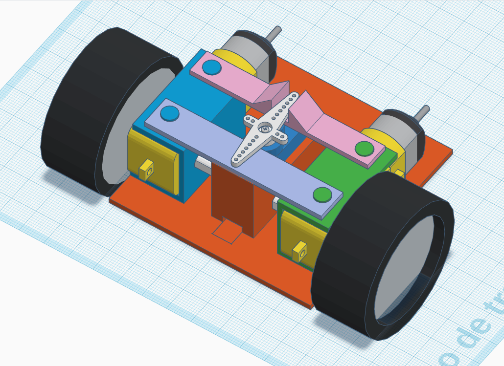

# Tesla Model 3

Modelo a escala de un Tesla Model 3

[Modelo v0](https://www.tinkercad.com/things/iwQ4f35aovJ) basado en el Modelo 3D by @gophy2018 de thingiverse

[Hilo de twitter](https://twitter.com/javacasm/status/1137281941793886208)

## [Dirección y tracción v0](./Direccion-traccion/SteeringTraction.md)

